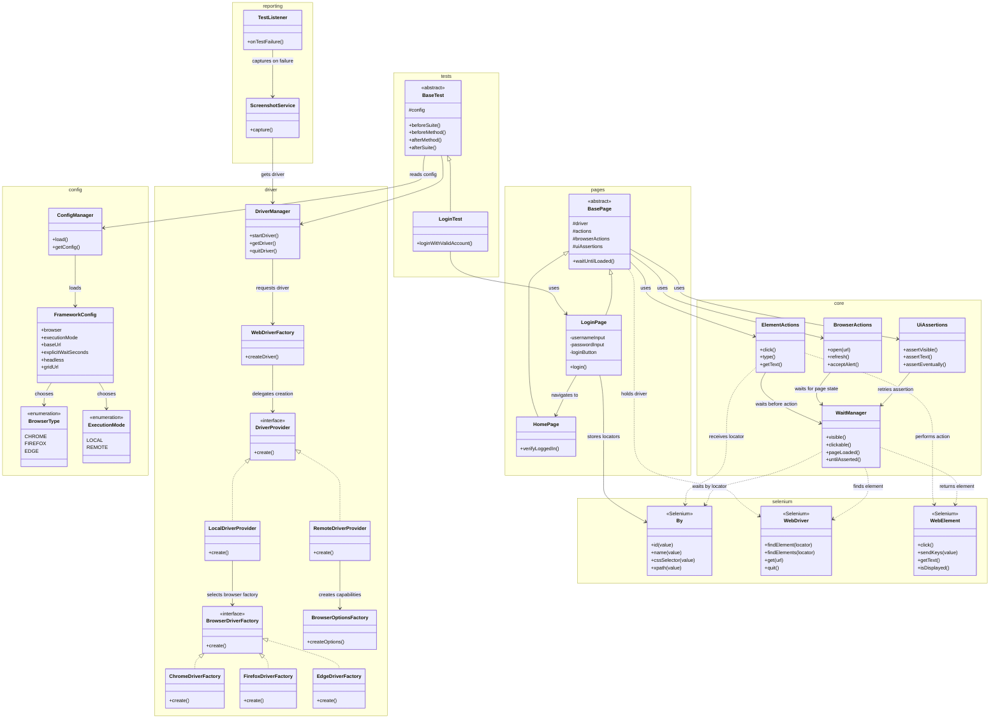

```mermaid

classDiagram

namespace config {
class BrowserType {
<<enumeration>>
CHROME
FIREFOX
EDGE
}

class ExecutionMode {
<<enumeration>>
LOCAL
REMOTE
}

class FrameworkConfig {
+browser
+executionMode
+baseUrl
+explicitWaitSeconds
+headless
+gridUrl
}

class ConfigManager {
+load()
+getConfig()
}
}

namespace driver {
class DriverManager {
+startDriver()
+getDriver()
+quitDriver()
}

class WebDriverFactory {
+createDriver()
}

class DriverProvider {
<<interface>>
+create()
}

class LocalDriverProvider {
+create()
}

class RemoteDriverProvider {
+create()
}

class BrowserDriverFactory {
<<interface>>
+create()
}

class ChromeDriverFactory {
+create()
}

class FirefoxDriverFactory {
+create()
}

class EdgeDriverFactory {
+create()
}

class BrowserOptionsFactory {
+createOptions()
}
}

namespace selenium {
class By {
<<Selenium>>
+id(value)
+name(value)
+cssSelector(value)
+xpath(value)
}

class WebDriver {
<<Selenium>>
+findElement(locator)
+findElements(locator)
+get(url)
+quit()
}

class WebElement {
<<Selenium>>
+click()
+sendKeys(value)
+getText()
+isDisplayed()
}
}

namespace core {
class WaitManager {
+visible()
+clickable()
+pageLoaded()
+untilAsserted()
}

class ElementActions {
+click()
+type()
+getText()
}

class BrowserActions {
+open(url)
+refresh()
+acceptAlert()
}

class UiAssertions {
+assertVisible()
+assertText()
+assertEventually()
}
}

namespace pages {
class BasePage {
<<abstract>>
#driver
#actions
#browserActions
#uiAssertions
+waitUntilLoaded()
}

class LoginPage {
-usernameInput
-passwordInput
-loginButton
+login()
}

class HomePage {
+verifyLoggedIn()
}
}

namespace tests {
class BaseTest {
<<abstract>>
#config
+beforeSuite()
+beforeMethod()
+afterMethod()
+afterSuite()
}

class LoginTest {
+loginWithValidAccount()
}
}

namespace reporting {
class TestListener {
+onTestFailure()
}

class ScreenshotService {
+capture()
}
}

ConfigManager --> FrameworkConfig : loads
FrameworkConfig --> BrowserType : chooses
FrameworkConfig --> ExecutionMode : chooses

BaseTest --> ConfigManager : reads config
BaseTest --> DriverManager
BaseTest <|-- LoginTest
LoginTest --> LoginPage : uses

DriverManager --> WebDriverFactory : requests driver
WebDriverFactory --> DriverProvider : delegates creation

DriverProvider <|.. LocalDriverProvider
DriverProvider <|.. RemoteDriverProvider

LocalDriverProvider --> BrowserDriverFactory : selects browser factory

BrowserDriverFactory <|.. ChromeDriverFactory
BrowserDriverFactory <|.. FirefoxDriverFactory
BrowserDriverFactory <|.. EdgeDriverFactory

RemoteDriverProvider --> BrowserOptionsFactory : creates capabilities

BasePage <|-- LoginPage
BasePage <|-- HomePage
BasePage ..> WebDriver : holds driver

LoginPage --> By : stores locators
BasePage --> ElementActions : uses
BasePage --> BrowserActions : uses
BasePage --> UiAssertions : uses
LoginPage --> HomePage : navigates to

ElementActions --> WaitManager : waits before action
ElementActions ..> By : receives locator
ElementActions ..> WebElement : performs action

BrowserActions --> WaitManager : waits for page state

UiAssertions --> WaitManager : retries assertion

WaitManager ..> WebDriver : finds element
WaitManager ..> By : waits by locator
WaitManager ..> WebElement : returns element

TestListener --> ScreenshotService : captures on failure
ScreenshotService --> DriverManager : gets driver

```

